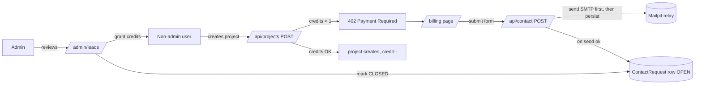

# Captured-lead credit gate

## What this is

A billing loop for a product that isn't ready to charge money yet. Users get a
fixed bucket of project credits. When a non-admin runs out, the app captures a
**lead** — a structured "I need N credits" request — that lands in an admin
ledger and triggers an email notification. An admin reviews it and grants
credits by hand. No payment processor is wired up.

The whole loop exists so the credit gate has a graceful exit other than a hard
wall: instead of "you're out, go away", it's "you're out, tell us what you're
building and we'll top you up".

> **Scope.** This explains *why* the loop is shaped the way it is. For the
> endpoint contract, see [API reference](./reference-api.md). For the data model,
> see [Data model reference](./reference-data-model.md).

## The problem (three failure modes, one feature)

Before the loop, the projects page had a loyalty-killing dead button and three
ways to lose a lead:

1. **The dead-button bug.** `handleCreate` was `if (res.ok) { … }` with no
   `else`. A 402 (out of credits) fell straight through to `finally`, so the
   button did nothing. The user clicked, saw no feedback, and clicked again.
   No error message, no redirect, no idea what happened.
2. **No "buy" destination.** Even if the 402 were surfaced, there was nowhere to
   send the user. "You're out of credits" with no path forward is just a wall.
3. **A lead could be silently dropped.** If the notification was the *last*
   step, an SMTP outage meant the row was already persisted and the email was
   just gone — an orphaned OPEN lead the admin never saw and the user thought
   was sent.

The same root defect caused all three: the credit-exhausted state was treated
as a terminal error instead of the start of a conversation.

## The approach

Five design decisions, locked in an engineering review, compose the fix. Each
one closes one of the failure modes above.

### D4 — Send first, then persist (the hard merge gate)

`POST /api/contact` sends the SMTP notification **before** it writes the
`ContactRequest` row. The send is the hard gate: if it fails, the route
returns 502 and **writes nothing**. The row only exists if the email was
delivered.

This inverted the natural order (you'd expect "save the lead, then notify"),
and it's the load-bearing decision of the whole loop. It makes the email and the
ledger row a single atomic fact — an undelivered lead never exists in the
system, so the admin ledger is a faithful record of what the user was actually
told was sent. A duplicate send on retry is annoying; a phantom lead the admin
never sees and the user believes was delivered is a trust failure.

The cost: a delivered email with a failed row-write would orphan the email
(sending the admin a lead that isn't in the ledger). That failure mode is rarer
(a DB write failing after a network send succeeds) and the envelope is
recoverable from the mailbox. The trade leans the right way.

### CQ-C — One OPEN lead per user

A user can have exactly one `OPEN` `ContactRequest` at a time. Submitting again
while one is open returns 409 and does **not** send a second email. This is
enforced with a `findFirst({ userId, status: "OPEN" })` lookup — pure Prisma, no
database-specific partial unique index, so it's portable across Postgres / SQLite.

The race window (two concurrent POSTs both passing the `findFirst` and both
sending) is real but narrow — a single user double-clicking is the only
realistic trigger — and the worst case is two emails and two rows, both
reconcilable in the admin ledger. A `SELECT FOR UPDATE` transaction or a
partial unique index would close it but add DB-specific surface. The ceiling is
documented; upgrade if anyone spams the endpoint.

### Reactive gate + branched 402

The projects page hides the "New Project" button when a non-admin has
`credits < 1` and shows a "Get credits" link to `/billing` instead. That's the
**proactive** gate — common path, no wasted request.

But the proactive gate has a race: credits can hit zero server-side after the
page loaded (or the user could POST directly). So the server route also checks,
and on exhaustion returns **402 Payment Required**. The page now has a real
`else` on the `if (res.ok)`:

- `402` → call `refreshUser()` (self-heal the cached credit count) **and**
  `router.push('/billing')`. This is the regression test (T9): before the fix,
  the 402 branch didn't exist, so it fell through to `finally` and the button
  looked dead.
- any other non-ok → surface the server's `error` string inline as a form alert.

### UserContext lifted, seeded server-side

User state used to be fetched client-side on first paint (a flash of
"unknown credits" + a self-fetch). It's now a React context seeded directly by
the `(app)` layout, which is `async` and calls `getSessionUser()` server-side.
The client gets the user object on the first render. `refreshUser()` re-reads
`/api/auth/me` when the credit count might have changed (after a 402, after a
project create).

This is what makes the self-heal on 402 work: the gate can ask the layout's
context to refresh, and the next render reflects the real credit count without a
full page reload.

### OV-β — Reply-To-bait envelope (mail rewriting-safe)

Gmail and Office 365 rewrite the `From` header of an outbound message to the
authenticated account's address — they will not let an app send mail "from" an
arbitrary user. So the notification's envelope `From` is the app's own leads
mailbox (`LEADS_TO_ADDRESS`), and the requester's email goes in `Reply-To` and is
**also embedded in the body**. A reply reaches the lead directly; and even if a
relays strips `Reply-To`, the address still survives in the message text.

## Trade-offs named

- **Atomicity leans toward the email, not the row.** A send that succeeds +
  a persist that fails = an email not in the ledger. Rarer than the reverse,
  and recoverable from the mailbox. Chosen deliberately (D4).
- **Dedupe is application-level, not database-level.** A partial unique index
  would be stronger but Postgres-specific. The `findFirst` check is portable
  and opens a narrow double-submit race. Documented ceiling, not a hidden bug.
- **No payment processor.** The loop captures intent and defers payment.
  Stripe Checkout slots in later at the `/billing` destination without touching
  the gate — the gate stays credit-based, the fulfillment path just becomes
  automatic instead of admin-granted.
- **Admin fulfillment is human.** Grants happen in `/admin/users`. There is no
  self-service buy. That's the point of "captured lead" — the team wants to
  talk to users before they pay.

## Alternatives considered

- **Persist first, then send (the natural order).** Rejected — an SMTP outage
  orphaned leads in the ledger that the admin never saw and the user thought
  were sent. Inverts to D4.
- **A partial unique index on `(userId, "OPEN")` for dedupe.** Rejected for
  portability (Postgres-specific) and because the race is narrow. Re-evaluatable.
- **A 200 on the 402 path.** Rejected — 402 carries the right semantics
  ("payment required") and lets the client branch on it. A 200 with an error
  field would have needed a hand-rolled status convention; `res.status === 402`
  is the standard.
- **Spawn a Stripe Checkout session immediately.** Deferred — the product
  wants a human in the loop during the pre-revenue phase. The `/billing`
  destination is shaped so Stripe can replace the contact form later without
  re-routing the credit gate.
