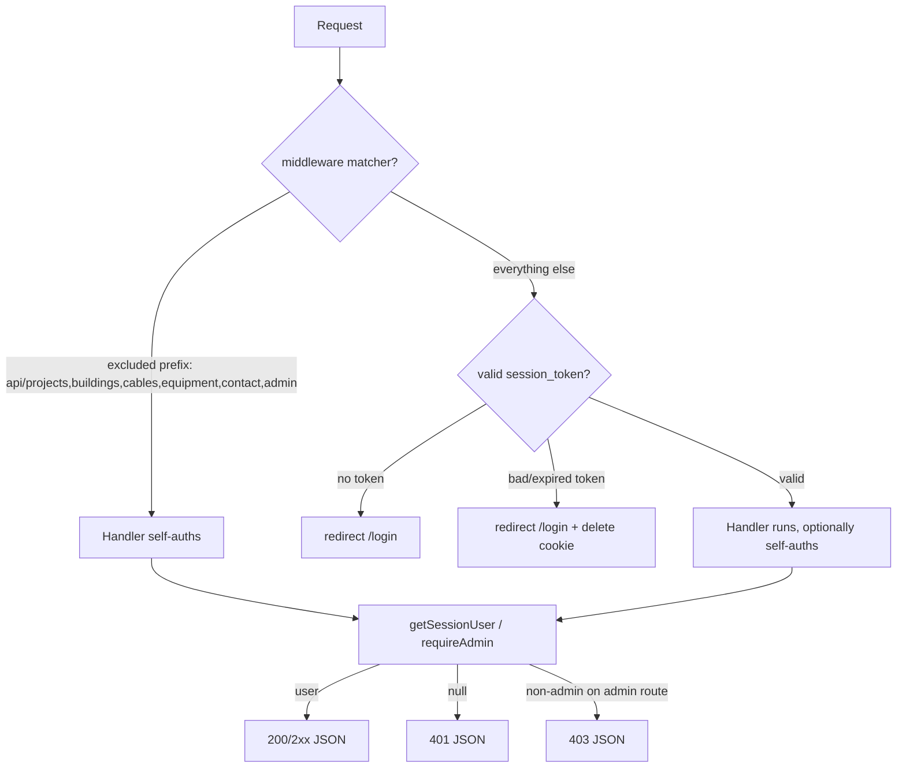

# Auth, middleware & admin reference

The session layer, the request-time gate, the admin area, and the user-state
context that ties them to the UI. Source of truth: `src/lib/auth.ts`,
`src/middleware.ts`, `src/app/api/auth/**`, `src/app/api/admin/**`,
`src/context/UserContext.tsx`, `src/lib/country-defaults.ts`.

## Auth primitives · `src/lib/auth.ts`

JWT-in-cookie sessions. No third-party auth provider.

```ts
signJWT({ userId, username, role })   // HS256, 24h expiry, setProtectedHeader
verifyJWT(token): payload | null        // null on any verify failure
getSessionUser(): Promise<User | null>
requireAdmin(): Promise<User | NextResponse>   // 401 / 403 NextResponse on fail
```

- `JWT_SECRET` is read **at module load** and throws if absent — the app
  hard-crashes on boot without it rather than silently signing with `undefined`.
- `getSessionUser` reads the `session_token` cookie, verifies the JWT, then does
  a **fresh DB lookup** with `select: { id, username, name, role, credits, email }`.
  The fresh lookup is why `disabled` users get a current answer (a user disabled
  after login is denied on the next `getSessionUser`, not 24h later), and why the
  credit count in context is never the stale JWT claim — the JWT carries no
  credits at all; they're read live.
- `requireAdmin` is the admin-route guard. It **returns** either the user or a
  `NextResponse` (401 unauth, 403 logged-in-but-not-admin), so the handler does
  `const gate = await requireAdmin(); if (gate instanceof NextResponse) return gate;`
  — after that line, `gate` is the admin user. This pattern (return-a-union) is
  why every admin route starts with the same two lines.

## Middleware · `src/middleware.ts`

A single matcher with a negative lookahead is the whole access-control surface
outside the handlers:

```
"/((?!api/projects|api/buildings|api/cables|api/equipment|api/contact|api/admin
      |_next/static|_next/image|favicon.ico).*)"
```

- **Excluded prefixes** (`api/projects|buildings|cables|equipment|contact|admin`):
  the matcher does **not** run on them. An unauthenticated request reaches the
  handler — which must self-auth. This is the deliberate part: these routes
  return **JSON** on auth failure (401/403), not a 302-to-`/login` HTML response.
  The billing fetch and the admin fetch would otherwise see the redirect HTML and
  fail to branch on a status code. The comment in `middleware.ts` calls this out
  (OV-α / CQ-B): excluding these prefixes "kills the cookie-expiry→silent-failure
  class" on the billing path and across all admin routes.
- **Everything else** (including `api/floors`, `api/loads`, `api/templates`,
  `api/settings`, `api/upload`, `api/breaker-*`, all pages): the matcher runs.
  No token → redirect to `/login`. Bad/expired token → redirect to `/login`
  **and delete the `session_token` cookie** (the `catch` branch clears it so a
  poisoned cookie doesn't loop).
- **Always-allowed paths**: `/login`, `/signup`, `/api/auth/*` pass through
  (checked before the token test) so the login flow itself isn't gated.

> **The matcher is the auth for `api/floors`/`/loads`/`/templates`/`/settings`/
> `/upload`/`/breaker-*`.** Those handlers don't *all* call `getSessionUser`
> (e.g. `PUT/PATCH /api/floors/[id]` don't) — they trust the matcher to keep
> unauthd callers out. Editing the matcher regex is therefore an auth change,
> not a cosmetic one. The matcher-excluded prefixes, by contrast, must never lose
> their self-auth, or they become open.

### One sessionless route

`POST /api/buildings/[id]/recalculate` is the odd one out. It's under
`api/buildings` (matcher-excluded) **and** it calls `getSessionUser` nowhere —
its only check is "building exists". So it is reachable without a session. Its
response carries no user data (just `{ success, updated, diversityFactor }`), so
nothing leaks, but it is the sole route whose posture is neither self-auth nor
matcher-protected. Documented here as a known gap. See
[API reference](./reference-api.md).

## Auth routes · `src/app/api/auth/`

All four are matcher-allowed (`/api/auth/*` passes the early `pathname.startsWith`
check), so they handle their own auth semantics.

### `POST /api/auth/register` · `register/route.ts`
`{ username, password, name, email }` → all required → 400. **Email is validated**
(`/^[^\s@]+@[^\s@]+\.[^\s@]+$/`) and trimmed — the email is the SMTP `Reply-To`
for the captured-lead loop and pre-fills `/billing`, so a malformed one is
rejected at the door (eng-review D3 / OV-γ), not stored to break the loop later.
`username` ≥ 3 chars, `password` ≥ 6 chars. Username uniqueness → 409. bcrypt
hash (cost 10). **Auto-login after register**: signs a JWT and sets the cookie in
the same response, so the user lands on the app authenticated with no second
POST. Cookie flags: `httpOnly`, `secure` only in production, `maxAge: 24h`,
`path: /`.

### `POST /api/auth/login` · `login/route.ts`
`{ username, password }` → 400 on missing. Unknown user → 401 "Invalid
credentials". `disabled: true` → **403 "Account disabled"** (soft-delete enforced
at login, distinct from a wrong password). bcrypt compare → 401 on mismatch.
Sets the cookie identically to register.

### `GET /api/auth/me` · `me/route.ts`
Returns `{ user }` on session, or **`{ user: null }` with status 200** on no
session — note the 200, not 401. This is deliberate: `UserContext.refreshUser`
just reads `data.user`, and a 200-with-null keeps the client from branching on
auth status when all it wants is the current state. This is the endpoint the
self-heal path hits after a 402.

### `POST /api/auth/logout` · `logout/route.ts`
Deletes the `session_token` cookie, returns `{ success: true }`. No server
session to invalidate (JWT is stateless), so logout is purely cookie-clearing.

## UserContext · `src/context/UserContext.tsx`

Client-side cache of the authenticated user, seeded server-side.

- `CurrentUser` is plain primitives only (`id, username, name, role, credits,
  email: string | null`) — it must be **RSC-serializable** because the `(app)`
  layout (an `async` server component) reads the user via `getSessionUser()` and
  passes it as `initialUser` to `<UserProvider>`. No first-paint self-fetch, no
  flash of "unknown credits" (eng-review P2).
- `refreshUser()` does `fetch("/api/auth/me", { cache: "no-store" })` and
  `setUser(data.user)`. This is the **CQ-A self-heal**: after a 402 (or an
  out-of-band admin credit grant) the caller `await refreshUser()` so the
  proactive gate reflects server truth. `no-store` matters — a cached `/me`
  would return the pre-grant credits.
- `useUser()` throws if used outside a `UserProvider` — fail-loud over
  fail-null, since a null user from a missing provider is a wiring bug, not a
  logged-out state.

The `select` in `getSessionUser`, the body of `/api/auth/me`, and `CurrentUser`
all carry the same six fields. Keep them in sync — adding a field to one without
the other two is a silent-undefined at the consumer.

## Admin routes · `src/app/api/admin/`

All gated by `requireAdmin()` (matcher-excluded, so they self-auth — 401/403
JSON, never a redirect). The `requireAdmin`-as-union pattern means every handler
opens with the same two lines.

### `GET /api/admin/users` · `admin/users/route.ts`
List with optional `search` query (OR on `username`/`name` `contains`). Selects
the safe subset (no `passwordHash`), includes `_count: { projects }` so the
admin table shows project counts without N+1. New-user `POST` on the same path:
`role` allow-listed (`ADMIN` else `USER`), `credits` must be a non-negative
integer else `0` (loop-fulfillment knob — same hardening as the PATCH).

### `PATCH /api/admin/users/[id]` · `admin/users/[id]/route.ts`
The credit-grant endpoint — the human fulfillment step of the captured-lead
loop. Accepts `role`, `credits`, `disabled` (any subset). **OV-δ hardening**:
`credits` must be a non-negative integer → 400 otherwise (matches the POST
sibling at `admin/users/route.ts:35`), so an admin can't "400-then-no-row" their
way to a half-state. `role` allow-listed (`ADMIN`/`USER`) → 400 on anything
else. Empty patch → 400 "Nothing to update". Returns the updated user (safe
select, no hash).

### `GET /api/admin/users/[id]/summary` · `admin/users/[id]/summary/route.ts`
One user's detail: the safe fields + `_count.projects` + the last 50 projects
(`orderBy createdAt desc, take 50`). Powers the admin user-detail view.

### `GET /api/admin/leads` · `admin/leads/route.ts`
The captured-lead ledger. `include: { user: { select: { id, username, name,
email } } }` so an admin can reply to the lead directly with no second lookup.
`orderBy createdAt desc`. This is the `/admin/leads` view's data source.

### `PATCH /api/admin/leads/[id]` · `admin/leads/[id]/route.ts`
Close/reopen a lead. `status` allow-listed (`OPEN`/`CLOSED`) → 400 otherwise — no
arbitrary string lands on the row. `closedAt` is **set when closing, cleared when
reopening**, so the two fields can't drift (an `OPEN` row with a `closedAt` would
be a lie). Prisma `P2025` (record not found) is caught → 404; anything else is a
real 500.

### `GET /api/admin/stats` · `admin/stats/route.ts`
Dashboard counts in one round trip (`Promise.all`): `user.groupBy` on
`[disabled, role]` (rolled into `{ total, enabled, disabled, admins }` client-side),
`project.count()`, `user.aggregate({ _sum: { credits } })` (total credits held
across all users), `equipmentCatalog.count()`. The groupBy shape is the cheap way
to get the disabled/admin breakdown in a single query rather than three counts.

### `GET/POST/DELETE /api/admin/breakers` · `admin/breakers/route.ts`
Equipment-catalog management. GET filters by `category` (comma-split, uppercased,
`in` if >1), `manufacturer` (skipped if `MIXED`), `familyId` (`"null"` → null
family), current range, and a post-fetch `search` on `model`/`series`
(`mode: insensitive` would be the SQL way; the JS filter is the codebase's
choice). POST creates a catalog row and **upserts its `BreakerFamily`** via
`upsertBreakerFamilies` (`src/lib/breaker-families.ts`) so a row's family is
auto-created/reused from `manufacturer+category+series`. DELETE takes a single
`id` query param `or` a `{ ids: string[] }` body for batch `deleteMany`.

### `POST /api/admin/breakers/import` · `admin/breakers/import/route.ts`
CSV catalog bulk-upsert. A **hand-rolled RFC-4180-ish CSV parser** (`parseCsv`)
handles commas and newlines inside quoted cells — no CSV dependency added (the
ponytail choice: a 70-line parser for a known shape beats a dep). Required
columns: `manufacturer, category, series, model, ratedCurrent, poles,
breakingCapacity, tripUnit, settingsJson, datasheetUrl` (header lowercased).
Per-row validation → per-row error entries (missing required fields, invalid
`ratedCurrent`/`poles`, unparseable `settingsJson` JSON). Valid rows are
`upsert`ed by the `catalogUniqueKey` (`manufacturer+category+series+model+
ratedCurrent+poles`), with `familyId` resolved via `upsertBreakerFamilies`. The
response is a **summary, not a throw** — `{ totalRows, validRows, applied,
validationErrors, upsertErrors }` so a partial import is reported, not rolled
back. (Export counterparts live at `admin/breakers/export/catalog` and
`.../export/template`.)

> **ponytail:** the CSV parser is hand-rolled because the catalog shape is fixed
> and a dep would be one more thing to audit. If quoted-CSV edge cases multiply,
> swap in `papaparse` — the `parseCsv` seam is the only thing to change.

## Country defaults · `src/lib/country-defaults.ts`

A static registry of per-country electrical + apartment-load assumptions, not a
DB table.

```ts
interface CountryConfig {
  voltage: number;       // line-to-line V, drives 3-phase current math
  frequency: number;     // 50 or 60
  powerFactor: number;   // default PF for the country
  roomDensities: { kitchen, bedroom, livingRoom, diningRoom, bathroom, hall, other }
  acSizingRules: AcSizingRule[];   // { maxArea, btu, watts } tiers
}
```

- **40+ countries** keyed by name (`"Syria"`, `"UAE"`, `"USA"`, …), all sharing
  one `DEFAULT_AC_RULES` array: 5 BTU tiers (9k @ ≤15 m² → 30k @ >50 m²) with
  matching `watts` (EER-derived). Room densities vary per country (kitchen 132
  VA/m² in Ghana → 170 in the USA); voltage/freq/PF are regional defaults (50 Hz
  / 0.85 PF across the Middle East, 60 Hz / 0.9 PF in much of Europe, 480 V in
  North America).
- `getCountryDefaults(country)` **falls back to `DEFAULT_COUNTRY_CONFIG`**
  (400 V / 50 Hz / 0.85 / `DEFAULT_DENSITIES`) for any unknown country — so a
  project with an unsupported country still computes, it just gets the neutral
  defaults. `/api/templates` rejects an unsupported country with 400 only if the
  lookup somehow returns null; in practice `getCountryDefaults` never does.
- `calculateRoomLoad(area, density, hasAc, acRules) = area·density +
  (hasAc ? acWatts : 0)`; `calculateAcWatts(area, rules)` picks the largest tier
  whose `maxArea >= area`, else the last (largest) tier.
- **Runtime overrides** are in-memory only: `/api/settings` POST writes to a
  `globalSettings` map seeded from `COUNTRY_DEFAULTS` — server restart reverts.
  `country` is the join key from `Project.country` (default `"Syria"`).

## How a request flows



## Related

- [API reference](./reference-api.md) — the route handlers these primitives
  guard, and the matcher-exclusion list they depend on.
- [Captured-lead credit gate](./explanation-billing-captured-lead.md) — why
  `/api/contact` and `/api/admin/*` are matcher-excluded (the JSON-401-not-
  redirect decision), and how `UserContext.refreshUser` self-heals after a 402.
- [Calc engine reference](./reference-calc-engine.md) — the country defaults and
  diversity factors feed the apartment-sizing routes.
