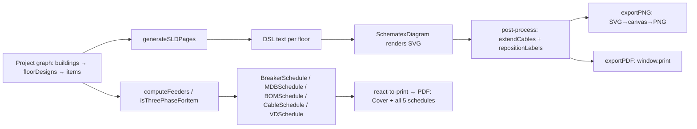

# SLD & reports reference

Two deliverable-generating surfaces: the **single-line diagram** (SLD) designer
and the **printable reports** (schedules + cover). Both read the same project
graph the calculator reads, so the printed/scaled output always agrees with the
on-screen numbers. Source of truth: `src/lib/sld/generator.ts`,
`src/app/(app)/sld/page.tsx`, `src/app/(app)/reports/page.tsx`,
`src/components/report/*`.



## SLD: DSL generation · `src/lib/sld/generator.ts`

The SLD is **not** drawn imperatively. The generator emits a small textual DSL;
`schematex/react`'s `<SchematexDiagram dsl={...} />` renders that DSL to an SVG.
This is the lazy choice — no hand-rolled SVG layout, no diagram-layout dep
maintained in-app; a domain-specific language + a renderer we don't own.

### `SLDProject` (generator's input shape)

A narrowed view of the project — only the fields the diagram needs:

```ts
interface SLDProject {
  name: string; voltage: number; frequency: number; powerFactor: number;
  transformerSize?: number | null;
  buildings: { name: string; floors: number; floorDesigns: {
    floorNumber: number; hasFloorSubPanels: boolean;
    items: { name: string; type: string; calculatedMaxDemand: number;
            calculatedCurrent: number; breakerSize: string; cableSize: string }[]
  }[] }[]
}
```

It's structurally compatible with the `Project` type — the SLD page passes the
whole fetched project straight in (`generateSLDPages(project)`), and excess
fields are ignored. No projection/DTO step.

### `generateSLD(project): string` — one big diagram

Emits a single DSL document: utility grid → transformer (`transformer_dy`,
defaults to 1000 kVA when `transformerSize` is unset) → MDB bus. Then for every
non-empty floor: an MDB bus → floor breaker → floor bus (or `distribution_board`
when `hasFloorSubPanels`, the sub-panel case) → per-circuit MCBs (`mcb`), each
with its `breakerSize` rating and a `cable:` tag carrying the `cableSize`. The
floor breaker rating is `Math.ceil(sum of item currents)`.

Two node kinds per floor, chosen on `hasFloorSubPanels`:
- **Direct floor** (`false`): floor bus is a plain `bus`. MDB → floor breaker →
  floor bus → MCBs.
- **Sub-panel floor** (`true`): the floor draws from a
  `distribution_board` (the sub-panel), itself fed by the floor breaker off the
  MDB. MDB → floor breaker → sub-panel board → MCBs.

### `generateSLDPages(project): SLDPage[]` — one page per floor

The page actually uses this one, not `generateSLD`. It slices the project into
**one diagram per floor** so each floor renders as a vertical layout instead of
a wide horizontal spread off the MDB bus — the on-screen and PNG-on-A4-readable
form. Each page's DSL starts with a short `mdb = bus` at the top, then the
floor's breaker → (bus | distribution_board) → MCBs down the page. Page title is
`F{n}`, subtitle `Floor {n} — {items} circuits`. Empty floors are skipped; empty
projects return `[]`.

> **`generateSLD` vs `generateSLDPages`.** The single-page `generateSLD` is
> exported and used by the test suite; the UI renders `generateSLDPages` (per-
> floor pages). Both share the same node vocabulary and the same
> `hasFloorSubPanels` branching. If you change the floor topology in one,
> change it in both — they have no shared inner helper (a ponytail seam that
> could be tightened if a third caller appears, but isn't worth it for two
> near-identical 30-line bodies).

### DSL vocabulary (what the strings mean to schematex)

- `grid = utility [label, voltage]` — the utility source
- `xfmr = transformer_dy [label, rating, voltage]` — Dyn transformer
- `bus = bus [label, voltage]` — a bus
- `distribution_board [label, voltage]` — a sub-panel board (drawn as a DB)
- `breaker [label, rating]` — a floor main breaker
- `mcb [label, rating]` — a circuit MCB (loads its `breakerSize` as label)
- `load [label]` — the load endpoint (tag like `F3-A`)
- `A -> B` — a connection; `[label: "Floor 3"]` annotates it; `[cable: "Wf3a",
  label: "4 mm²"]` annotates with a cable tag + size

The `bkr_…` / `load_…` / `floor_bus_…` identifiers are the node ids schematex
links; they're opaque to the renderer but stable per generation.

## SLD page · `src/app/(app)/sld/page.tsx`

Client component. Flow:

1. Fetches the project (`GET /api/projects/[id]`), picks a building (first by
   default if multi), calls `generateSLDPages(project)` → `pages`.
2. **Renders** `pages[activePage].dsl` via `<SchematexDiagram dsl={...} />`
   inside a white container.
3. **Post-processes the rendered SVG in-browser, after a `setTimeout` retry
   loop** (the SVG appears asynchronously; if `querySelectorAll('text')` is
   empty it retries after 500 ms — a wait-for-render hack, not a robust
   lifecycle hook). Two transforms run:
   - `extendCables(svg)` — finds horizontal bus lines (`y1===y2`, length > 200),
     then **extends short vertical lines/paths** that touch a bus by an `EXTRA`
     80 px, creating the ladder-step spacing between breaker levels. Resizes
     the viewBox accordingly.
   - `repositionLabels(svg)` — moves MCB-related text labels to the **right** of
     each MCB symbol (the diagonal-line breaker glyphs), aligned, skipping
     header/bus labels (`Single Line`, `MDB Bus`, `Utility`, `400V`,
     `Sub-Panel`, `DB`). Falls back to the nearest vertical cable if no MCB is
     nearby.
4. **Zoom**: applied to the `<svg>` element directly (`transform: scale`), not
   the container, so zoom doesn't clip. 50–200%.
5. **Exports**:
   - `exportPNG()` — clones the SVG, sets explicit width/height from the viewBox
     (or `getBBox`), serializes to an SVG blob, draws onto a 2× canvas with a
     white background (`fillRect` — so transparent SVG → white PNG), and triggers
     a download (`<a download>`) named `{project}-page{n}.png` (or
     `-diagram.png` for single pages).
   - `exportPDF()` — `window.print()`, relying on `print:hidden` on the chrome
     and the printable container. (The full multi-schedule PDF lives on the
     reports page, not here.)

> **`react-hooks/set-state-in-effect` is disabled** at the top of the file. The
> zoom effect and the post-process effect both set state/re-render; the lint
> quiet is intentional — the effects are idempotent transforms keyed on
> `[zoom, pages, activePage]` etc., and the alternative (moving the work out of
> effects) would mean re-rolling the SVG lifecycle. Accept the disabled rule;
> don't add new stateful effects without the same justification.

## Reports · `src/app/(app)/reports/page.tsx`

Client component producing a printable, paginated report. Two render trees:

1. **Screen tree** — a tabbed UI (Project Summary / Bill of Materials / MDB
   Schedule / Cable Schedule / Voltage Drop). The active tab renders into a
   white card. `print:hidden` on the chrome.
2. **Print tree** — an off-screen `<div ref={printRef}>` at
   `left: -9999px`, **always mounted**, cloned into an iframe by
   `react-to-print`'s `useReactToPrint({ contentRef: printRef, documentTitle })`
   on "Export PDF". It composes:
   - `CoverPage` (project name, client, company name + logo)
   - Then **one page per schedule**, each preceded by `ReportHeader` and forced
     onto its own page via `pageBreakBefore: 'always'` / `breakBefore: 'page'`:
     `BOMSchedule` → `MDBSchedule` → `CableSchedule` → `BreakerSchedule` →
     `VDSchedule`.

The screen-tree tabs omit `BreakerSchedule` (it's print-only in the tab list —
the 5 screen tabs are summary/bom/mdb/cable/vd; the print tree adds the breaker
schedule as its own page). `BreakerSchedule` takes the project's
`preferredManufacturer` (from `ProjectContext`), the others don't filter on
manufacturer.

### Company branding

`GET /api/settings` → `company: { companyName, logoUrl }` primes the cover/header.
That's the file-based `data/company.json` (see [API
reference](./reference-api.md)) — the logo uploads via `/api/upload`. A fetch
failure silently leaves `{ companyName: "", logoUrl: "" }` so the report still
renders with blanks, not a crash.

### Summary page math (inline, no calc-engine import except `calculateThreePhaseCurrent`)

- Total apartments per building = `floors × apartmentsPerFloor`.
- Total demand = sum over `floorDesigns` of sum of `item.calculatedMaxDemand`
  (the stored, re-computed demand from `/api/floors/[id]/items` and
  `recalculate`).
- Main current = `calculateThreePhaseCurrent(totalDemand × 1000, voltage)` —
  **assumes 3-phase** for the building main, regardless of apartment phase. That
  matches the feeder model (the riser/main is always 3-phase, see
  [Calc engine reference](./reference-calc-engine.md), `feeders.ts`).

## Schedule components · `src/components/report/*`

All take `{ project, buildingId?, showHeader? }` (the breaker one adds
`manufacturer?`). `buildingId` scopes a single-building view; omitted = all
buildings. All are pure client render over the project graph + the calc engine —
no per-row fetch.

### `BreakerSchedule.tsx`
**The one that calls `computeFeeders`.** Fetches `/api/equipment?manufacturer=…`
(mixing skipped), builds a `FindBreaker` that **matches category + poles (≤2
for 1-phase, =3 for 3-phase) + ratedCurrent ≥ need, smallest match, fallback
flag on miss**. Then `computeFeeders(bldg, project, findBreaker)` →
`mdbFeeders` + `smdbFeeders(floorNumber)` flattened into rows, grouped by
`type` (APARTMENT / SERVICE_PANEL / PUMP_PANEL / ELEVATOR_PANEL), with floor
parsed from the feeder name (`/^F(\d+)/`). This is the load-bearing reuse: the
printed breaker schedule **always agrees** with the Panel designer page, because
they share `computeFeeders`. `isThreePhase` is `type !== 'APARTMENT'`.

### `CableSchedule.tsx`
Per-item rows from `floorDesigns.items`, phase label via
`isThreePhaseForItem(item)`, current/breaker/cable from the stored item fields,
method/insulation with `C`/`XLPE` fallbacks. No `computeFeeders` — it lists
**per-circuit** cables (every floor item), not feeders.

### `MDBSchedule.tsx`, `BOMSchedule.tsx`, `VDSchedule.tsx`
The MDB, bill-of-materials, and voltage-drop schedules. They compose off the
same project graph + calc-engine helpers (MDB from `computeFeeders`; VD from the
riser/feeder voltage-drop math in `cables.ts` + `riser.ts`).

### `CoverPage.tsx`, `ReportHeader.tsx`
Print-only branding: cover page (project + company identity) and the repeating
per-page header. Driven by `companyName`/`companyLogoUrl` from `/api/settings`.

## How the pieces share numbers

| View | Source of feeder/breaker/cable numbers |
|------|-----------------------------------------|
| Panel designer page | `computeFeeders(building, project, findBreaker)` live |
| Breaker Schedule (print) | `computeFeeders(building, project, findBreaker)` live |
| SLD | stored `item.calculatedCurrent` / `.breakerSize` / `.cableSize` (written by `/api/floors/[id]/items` + `recalculate`) |
| Cable Schedule | stored `item.*` per circuit |
| Reports summary | `calculateThreePhaseCurrent(Σ item.calculatedMaxDemand)` |

The SLD and the cable schedule read **stored** item fields (the numbers written
at insert/recalculate time). The breaker schedule reads them **live** via
`computeFeeders`. If those ever disagree, `recalculate` is the reconciliation
button — it re-sizes every apartment item from its template rooms and writes
the stored fields back. Run it before printing if templates or apartment counts
changed since the items were last sized.

## Related

- [Calc engine reference](./reference-calc-engine.md) — `computeFeeders`,
  `isThreePhaseForItem`, `calculateThreePhaseCurrent`, the voltage-drop math
  the VD schedule reads.
- [API reference](./reference-api.md) — `/api/projects/[id]` (the project graph
  both pages fetch), `/api/equipment` (the breaker-schedule catalog fetch),
  `/api/settings` (company branding), `/api/upload` (logo).
- [Data model reference](./reference-data-model.md) — the `FloorItem` stored
  sizing fields (`calculatedCurrent`, `breakerSize`, `cableSize`,
  `installMethod`, `cableInsulation`) both surfaces render from.
